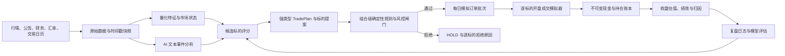

# AI 模拟交易系统设计方案（讨论稿）

> 状态：核心业务规则、飞书收件人与 DeepSeek 已联调；Tiingo Token 和免费行情源待实施期联调
>
> 日期：2026-07-15
>
> 初始资金：100,000 元人民币
>
> 范围：A 股、A 股场内基金、港股；仅模拟交易，不接券商账户，不产生真实委托

## 1. 结论先行

第一版建议做成一个“盘前做决策、开盘模拟成交、盘后统一记账复盘”的全自动模拟账户：

1. 每个自然日可以交易多个标的，但同一账户、同一标的每天最多冻结一笔订单；未成交、执行拒绝或行情逾期也占用该标的当日额度。
2. 盘前订单在 08:45 冻结，只能使用当时已经发布且已经入库的数据。
3. 第一版不依赖实时行情。收盘后从通过质量闸门的公开日线取得当日 `open` 和 `close`，用 `open + 不利滑点` 回填开盘成交，用 `close` 估值。
4. AI 负责研究、排序、解释和提出交易意图；确定性的规则引擎负责是否允许下单。通过风控后系统可自主冻结模拟订单，无需人工批准；AI 无权直接修改现金、持仓和成交。
5. 港股按直接港股账户模拟。采用人民币、港币子账本，账户本位币为人民币；港股成交和持仓以港币记账，再按当日汇率折算人民币净值。
6. “收益最大化”定义为：在最大回撤、仓位、流动性和合规约束下，最大化扣除费用和滑点后的累计收益，而不是无约束地押注单一高波动标的。
7. 行情只使用允许个人本地研究的免费公开数据，采用多源核验和按标的 `fail closed`；数据不完整时宁可不成交，也不推测成交。
8. 上线前必须经过历史走步回测和至少 20 个交易日的影子运行；系统永远不接真实券商交易接口。

这套设计不能保证收益，更不能保证“市场上可能达到的最大收益”；它的设计目标是固定交易口径，并通过自动化测试证明没有未来函数、结果可复算、每笔决策可解释。

## 2. 第一版业务边界

### 2.1 支持范围

- 沪深 A 股普通股票、科创板和创业板股票。
- 沪深上市 ETF、LOF 等场内基金，但回转规则按单只证券主数据判断。
- 港股主板普通股和普通 ETF。
- 用户手工维护的自选股，以及系统自动发现后加入的候选股。

已确认的初始自选股如下，代码统一标准化后入库：

| 标准代码 | 名称 | 市场 | 币种 | 来源 |
|---|---|---|---|---|
| `603005.SH` | 晶方科技 | 上交所 | CNY | 用户初始自选股 |
| `600584.SH` | 长电科技 | 上交所 | CNY | 用户初始自选股 |
| `02513.HK` | 智谱（港交所简称 `KNOWLEDGE ATLAS`） | 港交所 | HKD | 用户初始自选股 |
| `01810.HK` | 小米集团-W | 港交所 | HKD | 用户初始自选股 |

这四只初始标的不适用 AI 新增标的冷却期，但仍须在首次交易前核验上市状态、交易状态、港股整手数和价格单位。

代码与名称已通过交易所公开材料交叉确认：[晶方科技 603005](https://big5.sse.com.cn/site/cht/www.sse.com.cn/disclosure/listedinfo/announcement/c/new/2025-04-19/603005_20250419_DDKF.pdf)、[长电科技 600584](https://www.sse.com.cn/lawandrules/sselawsrules2025/trade/specific/margin/c/c_20260710_10825136.shtml)、[智谱 02513](https://www.hkexnews.hk/listedco/listconews/sehk/2026/0707/2026070700463_c.pdf)和[小米集团-W 01810](https://www1.hkexnews.hk/search/titlesearch.xhtml?category=0&market=SEHK&stockId=190371)。这些材料只确认证券身份，不替代每日交易状态核验。

### 2.2 默认排除

- 北交所、B 股、债券、可转债、期权、期货、权证、牛熊证。
- 融资、融券、裸卖空、杠杆及反向产品。
- ST/退市风险证券、长期停牌证券、上市不足 60 个交易日的新股。
- 数据不完整、无法确认整手/价格限制/交易状态的证券。
- 港股碎股市场。港股订单默认只按整手交易。

北交所和港股通可以在后续版本增加，但不能与当前已经确定的直接港股账户混为一套规则。

### 2.3 默认账户约束

| 项目 | 默认值 |
|---|---:|
| 交易方向 | 只做多 |
| 订单频率 | 同一标的每天最多 1 笔；不同标的可分别交易 |
| 单只股票上限 | 净值的 30% |
| 单只场内基金上限 | 净值的 50% |
| 单一市场上限 | 净值的 85% |
| 单一行业上限 | 净值的 60% |
| 最低现金比例 | 0%，但冻结买单时必须预留最坏情形资金 |
| 单笔订单上限 | 净值的 30% |
| 每日新增风险上限 | 净值的 50% |
| 每日总换手上限 | 净值的 100% |
| 流动性限制 | 订单金额不超过近 20 日中位成交额的 0.1% |
| 回撤告警阈值 | 20%，降低新增仓位系数 |
| 停止新增风险阈值 | 25%，拒绝全部新买单 |
| 硬回撤阈值 | 30%，拒绝买单并允许多个持仓同时减仓 |

以上配置命名为 `AGGRESSIVE_V1`。其中 30% 最大回撤阈值和激进风格已由用户确认，其余仓位、换手和缓冲阈值是配套的系统默认值，必须版本化并可调整。30% 是按人民币收盘净值相对历史高水位计算的风控触发线，不是收益保证；跳空、数据延迟和只有日线等因素可能使实际模拟回撤越过该数值。

## 3. 每日运行闭环

| 时间（Asia/Shanghai） | 任务 | 主要产物 | 是否可改变当日订单 |
|---|---|---|---|
| 07:50 | 数据与日历健康检查 | 交易日状态、数据新鲜度、异常清单 | 否 |
| 08:00 | 冻结盘前信息快照 | T-1 日线、08:00 前公告/新闻、财务与宏观数据 | 否 |
| 08:10 | 市场状态分析 | A/H 风险环境、行业强弱、波动与流动性状态 | 否 |
| 08:25 | 持仓、自选股、候选股评分 | 买入/卖出/持有候选及证据 | 否 |
| 08:35 | AI 生成多标的交易计划 | 一个 `TradePlan`，包含 `0..N` 个标的提案 | 否 |
| 08:40 | 组合级确定性风控 | 按最坏成交子集审核、排序、拒绝或降为 HOLD | 否 |
| 08:42 | 持久化最终计划与飞书 outbox | 完整计划、风险结果和幂等通知事件；仅供参考，不等待批准 | 否 |
| 08:45 | 原子冻结开盘限价订单 | 每个标的至多一个 `PENDING_OPEN` 订单，并预留全部买单资金 | 是，冻结后不可改 |
| 开盘后 | 模拟等待成交 | 第一版不使用未授权实时行情 | 否 |
| 18:15 起 | 轮询并校验 A/ETF/HK 日线、停牌数据与汇率 | 校验 `trade_date`、`source_asof`、预期条数和汇率陈旧度；超时标记 stale | 否 |
| 数据校验通过后 | 逐订单回填成交并记账 | `FILLED`、`UNFILLED`、`EXECUTION_REJECTED` 或 `DATA_UNAVAILABLE` | 否 |
| 记账完成后 | 收盘估值、复盘并写入飞书 outbox | 净值、盈亏归因、判断校准、次日观察清单和日报 | 否 |

盘后分析可以产生“次日观察建议”，但不能倒填为当日交易；第二天盘前仍要结合隔夜新增信息重新决策。

每个交易日都发送盘前计划，即使所有标的都是 HOLD；盘后数据齐全后发送成交和盈亏日报，数据延迟则先发暂估状态并在账本完成后更新。AI 新候选在发现后立即生成独立通知。所有通知使用确定性幂等键，计划和日报投递失败只重试通知，不等待用户批准；新候选必须通知成功后才能开始冷却并进入可交易池。

沪深交易所自 2026-07-06 起允许 A 股和 ETF 在 15:05—15:30 进行盘后固定价格交易。第一版有意关闭这条路径，原因是要保持 A/H 两地的一致决策截止时间，也避免盘后信息被错误用于当天成交。

## 4. 系统架构



### 4.1 模块职责

1. **数据层**：供应商适配、原始快照、证券主数据、允许获取的公告证据与官方链接、质量检查。
2. **研究层**：技术、基本面、事件、市场状态与流动性特征。
3. **AI 决策层**：生成有证据、有反方观点、有失效条件的候选提案。
4. **规则与风控层**：执行交易制度、资金、组合仓位和同标的每日一次约束。
5. **模拟成交层**：处理开盘价、限价、滑点、停牌、涨跌停、整手和未成交。
6. **账本与绩效层**：现金、持仓批次、公司行动、费用、汇率、每日净值和归因。
7. **编排层**：定时任务、幂等、失败恢复、运行锁与审计日志。
8. **查询界面**：今日决策、账户、持仓、自选股、交易日志、绩效和数据健康度。

## 5. 交易与成交语义

### 5.1 “同一标的每天最多一次”的确定定义

- 以 Asia/Shanghai 自然日为额度边界；同一账户、同一标准化 `instrument_id` 最多冻结一笔买入或卖出订单，不同标的可以在同一天分别交易。
- 同一标的当天不能先买后卖、先卖后买、撤单后补单或拆成多个子单；这一产品约束同样覆盖市场本身允许日内回转的港股和部分场内基金。
- `HOLD` 和风控阶段被拒绝的提案不占额度；订单一旦进入 `PENDING_OPEN`，无论最终成交、未成交、执行拒绝或行情不可用，都占用该标的当日额度。
- 数据库在 `orders(account_id, trade_date, instrument_id)` 上建立唯一约束，定时任务、手工重跑和进程重启都不能绕过。
- 当天可以同时卖出多个风险持仓、卖出一个标的并买入另一个标的，但所有提案必须先合并成每标的一个净交易意图。
- 组合级优先顺序为：硬性风控卖出 > 模型卖出 > 新买入 > HOLD；同时受每日新增风险和总换手上限约束。

### 5.2 开盘限价成交模型

盘前冻结的是带保护价的开盘限价单，不是事后按最低价挑选的理想化订单。

- 买单：只有通过质量闸门的公开日线开盘价不高于买入限价时才可能成交。
- 卖单：只有通过质量闸门的公开日线开盘价不低于卖出限价时才可能成交。
- 第一版成交价采用“合格公开日线开盘价加不利滑点”，并且不得越过限价。
- 没有形成集合竞价开盘价时，日线 `open` 应对应随后产生的第一笔成交价。
- 停牌、成交量为零、关键字段缺失时一律不成交。
- 涨停买入或跌停卖出若只有日线而没有竞价量，采用保守的 `UNFILLED`，不假设一定排队成交。
- 日线无法精确还原开盘竞价队列，因此报告必须标注“简化成交模型”；升级分钟/竞价数据后再支持部分成交。

### 5.3 市场差异必须数据化

- 普通 A 股买入后当日不可卖出；港股当日买入的证券通常可由券商安排当日卖出。当前交易所参与者与结算所之间仍按 T+2 交收，券商与客户之间的交收属于商业安排；系统仍禁止无持仓先卖和负持仓。
- 场内基金回转规则必须逐证券维护：债券 ETF、交易型或上市交易货币市场基金、黄金 ETF、商品期货 ETF，以及符合条件的跨境 ETF、跨境 LOF 可以当日回转；普通境内股票 ETF 通常不能当日买入后卖出。
- 沪深主板和创业板买入申报通常为 100 股或其整数倍；科创板股票单笔申报不少于 200 股，不按 100 股整数倍处理。主板股票通常实行 10% 涨跌幅限制，创业板和科创板通常实行 20%；IPO 前五个交易日等例外必须按逐证券规则读取。
- 港股整手由发行人/证券决定，不能假设为 100 股；碎股不进入普通自动撮合簿。
- 港股没有统一的每日涨跌停板，VCM 也不是 A 股式涨跌停。
- 港股开市前时段有独立价格控制：9:00—9:15 输入的竞价限价盘通常须位于前收盘价 ±15% 范围；9:15 后拟参与 POS 撮合的新竞价限价盘须位于 9:15 记录的最高买价与最低卖价之间。IPO、复牌等存在例外；这不能复用 A 股式每日涨跌幅字段。

证券主数据至少包含：

```text
market
board
currency
lot_size
min_order_quantity
quantity_step
price_tick_rule
opening_auction_order_types
pos_price_rule_version
pos_price_limit_exempt
settlement_cycle
same_day_turnaround_allowed
short_sell_allowed
upper_limit
lower_limit
limit_exempt
is_cas_eligible
is_vcm_eligible
is_tradable
effective_from
effective_to
```

### 5.4 费用、汇率和公司行动

- 佣金、最低佣金、印花税、交易征费、结算费和汇兑价差全部使用带生效日期的费率表。
- 港股固定按直接港股账户模拟，维护独立 HKD 现金子账本。初始 HKD 现金为零；港股买入前按盘前可得公开汇率和不利汇兑点差模拟 CNY→HKD 换汇，换汇本身不占证券订单额度，但本金、点差和费用必须随买单原子预留。
- 领域层现金和价格使用 `Decimal`；SQLite 持久化使用带明确比例的整数，例如 `amount_micros`、`price_micros`，不能用二进制浮点数记账。
- 原始成交和估值使用不复权价格；复权价格只用于特征和历史研究。
- 分红、送股、拆合股、配股等进入独立公司行动流水，不能只靠复权价掩盖。
- 停牌或无成交时沿用最近一个通过质量闸门的收盘价，同时标记 `price_stale=true`。

## 6. AI 决策系统

### 6.1 三层决策，而不是让大模型猜涨跌

1. **量化层**：计算动量、趋势、反转、波动率、成交额、估值、盈利质量、行业相对强弱和市场状态。
2. **文本事件层**：只读取允许自动访问、带时间戳的公告、发行人材料和许可新闻，提取事件、影响方向、持续期和不确定性；每条判断必须引用原始证据。免费模式缺少合格文本源时该层权重归零，退回量化基线或 HOLD，不能让模型补写事实。
3. **确定性策略层**：把量化分数、事件分数、交易成本和风险约束合并，选择 BUY、SELL 或 HOLD。

大模型最适合做公告理解、反方论证和决策解释；价格预测、仓位计算、合规检查和账本更新由可测试的确定性代码完成。

### 6.2 每日候选选择

- 先为现有持仓计算是否需要退出，再计算用户自选股的进入机会。
- 最后从包含沪深主板、科创板、创业板和港股的合格股票池中发现新候选；系统每天最多自动提出 3 只观察标的。
- AI 新增标的先进入 `PENDING_NOTIFICATION`。飞书通知成功后进入 `COOLING`，经过该标的所属市场至少一个完整交易日后进入 `ACTIVE`，不能“发现当天立即买入”。
- 新增通知包含代码、名称、市场、加入理由、证据截止时间和最早可交易日；通知失败时只重试该事件，不影响既有标的交易，但该新标的不得进入可交易池。
- 用户固定的自选股不会被系统自动删除；AI 候选默认 20 个交易日无新证据后过期。
- 每条候选记录 `added_by`、`reason`、`evidence_as_of`、`notification_status`、`eligible_from`、`expires_at` 和 `model_version`。

### 6.3 交易计划与提案必须强类型

```text
trade_plan_id
decision_asof
portfolio_snapshot_id
priority
action: BUY | SELL | HOLD
instrument_id
current_quantity
target_quantity
delta_quantity
order_type: OPENING_LIMIT
limit_price
expected_holding_days
expected_return_range
confidence
thesis_evidence_ids
counter_thesis
invalidation_conditions
model_version
data_snapshot_id
```

一个 `TradePlan` 可以包含多个标的提案，但同一计划内每个标的只能出现一个净交易意图。未声明字段、没有证据、时间戳晚于盘前快照或无法通过结构校验的提案直接拒绝。

DeepSeek 只负责生成候选计划：决策模型固定为 `deepseek-v4-pro`，开启 thinking 且 `reasoning_effort=high`；候选摘要、日报排版和飞书文案使用 `deepseek-v4-flash` 并关闭 thinking。核心调用采用 [JSON Output](https://api-docs.deepseek.com/guides/json_mode/) 的 `response_format={"type":"json_object"}`，但 JSON 可解析不等于符合业务结构，返回内容仍必须通过 Pydantic 强类型校验和确定性风控。

只有 `finish_reason=stop`、输出非空、JSON 可解析、字段完整且风险闸门通过时，提案才可进入订单候选。截断、空输出、schema 失败或 DeepSeek 不可用一律退回量化基线或 HOLD。交易核心不使用 `/beta` 的 strict tool calling，也不给模型任何写账本或执行订单的工具。

### 6.4 “自我学习”的边界

- 每晚记录预测收益区间、实际收益、是否成交和失败原因。
- 每周只做稳定性与数据漂移诊断；达到预设最小样本量后，才在月度或季度窗口做概率校准和走步验证。
- 新模型只有在样本外、扣除成本后优于基线且回撤不恶化时才能晋升。
- 生产模型不能每天自行改代码、改风控或改提示词；任何变更都要生成新版本并可回滚。

## 7. 优化目标与风控

### 7.1 目标函数

每日候选可使用以下思想排序：

```text
预期效用 = 预期持有期收益
         - 下行尾部风险惩罚
         - 交易费用与滑点
         - 模型不确定性惩罚
```

系统级验收采用有约束的词典序目标：

1. 不违反交易规则，不使用未来信息；
2. 最大回撤不超过确认的风险预算；
3. 最大化扣费后的累计收益；
4. 收益接近时，选择回撤更小、换手更低的方案。

### 7.2 风险闸门

风控以整个 `TradePlan` 为单位，不能让多笔买单分别读取同一份现金后各自通过：

1. 先把提案归并为每个标的一个目标仓位，按硬性风控卖出、模型卖出、新买入排序。
2. 校验交易日、证券状态、整手、最小申报量、价格范围、可卖数量、A 股 T+1 和同标的当日额度。
3. 按“所有买单成交、所有卖单均未成交”的最坏情形，检查现金、单股、单市场、行业、每日新增风险和总换手；买单不得依赖同日卖出回款。
4. 对受影响标的数据逐一核验；关键源冲突只阻断该标的，不应无故阻断整个计划。
5. 冻结订单时在同一数据库事务中预留所有买单的本金、费用和换汇成本，保证任意实际成交子集都不超预算。
6. 组合回撤达到 25% 时拒绝全部新买单；达到 30% 时只允许风险降低方向订单，不同持仓可以同时生成减仓单。
7. 同一标的当日已存在冻结订单或并发任务持有该标的交易锁时，后续提案一律拒绝。

计划通知不构成人工审批。最终计划和通知 outbox 成功入库后，交易任务按时继续；飞书远端投递失败由独立任务重试，不改变已经冻结的既有标的订单。

## 8. 数据设计

### 8.1 免费公开数据模式

第一版固定为 `PUBLIC_BEST_EFFORT_V1`：不要求 Tushare Token，不购买行情权限，不使用实时行情，只服务本机个人模拟研究。A 股主源可以使用 Tiingo 免费 Starter Token；它不产生数据费用，但需要免费注册。免费和公开不等于可任意自动抓取、稳定可用或可再分发，因此每个适配器都必须记录许可边界、版本、失败率并支持立即关闭。

| 角色 | 数据源 | 用途 | 约束与失败策略 |
|---|---|---|---|
| A 股/ETF 主源 | Tiingo EOD REST API | 入选标的的 raw/adjusted OHLCV、现金分红和拆股因子 | 免费 Starter 需 Token，限个人内部使用且有月度标的/请求额度；中国市场更新时间无 SLA，不承担全市场扫描 |
| A 股批量筛选与交叉源 | BaoStock 0.9.3 | A 股批量日线、交易状态；近期 ETF 日线 | 免费、无 SLA、无港股；ETF 日线仅覆盖 2026-01-05 起，不能单独承担长期 ETF 回测 |
| A/ETF/HK 研究交叉源 | AKShare | 低频候选发现、A 股、场内基金和港股日线 | 官方声明仅供学术研究且接口可能移除；必须经强类型适配器、缓存和源级熔断 |
| A/H 公开源 | Yahoo Finance + yfinance | 四只初始标的日线、港股主行情、部分公司行动和汇率候选 | 非 Yahoo 正式 API、无 SLA、仅适合个人研究；必须缓存、限速和指数退避，smoke test 或条款复核未通过时关闭 |
| A 股官方证据 | 上交所、深交所、巨潮 | 证券身份和人工审计所需公告原文链接 | 不假设网页存在稳定 API；保存链接、发布时间和校验值，不进行未获允许的系统性抓取 |
| 港股官方证据 | HKEXnews、港交所每日行情表 | 证券身份和人工抽样核验 | 港交所使用条款禁止未经许可的脚本化或系统性抓取，因此不作为自动运行时数据源 |
| 日常汇率 | 独立公开 HKD/CNY 日线源，至少一主一备 | 港元换汇与人民币净值 | 使用盘前已经可得的最近汇率；超过陈旧度阈值则阻断港股买单并把净值标为暂估 |
| 汇率回填核验 | 中国外汇交易中心、香港金管局开放 API | 人工核验和历史回填 | 中国外汇交易中心页面不是已确认的自动 API；香港金管局目录按月更新，不能当晚间实时源 |

第一版实现和 smoke test 的接口候选：

```python
GET https://api.tiingo.com/tiingo/daily/{ticker}/prices

bs.query_history_k_data_plus("sh.603005", "date,code,open,high,low,close,...", frequency="d", adjustflag="3")
bs.query_daily_history_k_AStock(date="YYYY-MM-DD")
bs.query_daily_history_k_ETF(date="YYYY-MM-DD")  # 仅有 2026-01-05 起数据

ak.stock_zh_a_hist(symbol="603005", period="daily", start_date="YYYYMMDD", end_date="YYYYMMDD", adjust="")
ak.fund_etf_hist_em(symbol="基金代码", period="daily", start_date="YYYYMMDD", end_date="YYYYMMDD", adjust="")
ak.stock_hk_hist(symbol="02513", period="daily", start_date="YYYYMMDD", end_date="YYYYMMDD", adjust="")

yfinance.Ticker("603005.SS" | "600584.SS" | "2513.HK" | "1810.HK")
```

上述签名在编码时仍要以锁定版本的官方文档和 smoke test 为准，不能把文档示例当成永久 API。所有原始响应先落只读快照，再由适配器标准化；策略层不直接依赖供应商字段名。

免费模式的成交数据策略：

- A 股和 ETF 对入选标的采用 `Tiingo 主源 -> Yahoo/yfinance 备源 -> BaoStock/AKShare 交叉`；主备 raw close 偏差超过 0.5%（可配置）、日期不一致或成交量单位无法统一时进入 `DATA_QUARANTINED`。
- 港股采用 `Yahoo/yfinance 主源 + AKShare 交叉源`。只有单源、两源冲突、整手数未知、停牌状态未知或公司行动未处理时，该标的只能 HOLD 或减仓，不能新买入。
- 18:15 和 20:30 轮询，当晚仍缺数据时先发送“暂估”盘后消息；次日 07:50 做最终完整性检查。仍无合格当日行情的订单进入 `DATA_UNAVAILABLE` 且不得倒填成交，迟到数据只用于审计和后续估值。
- 使用 raw OHLC 计算成交和每日盈亏，复权数据只用于信号。非涨跌停原因的价格跳变超过 15%、成交量为零、连续缺 bar 或名称/代码变化时进入隔离，不能自动猜测停牌或公司行动。
- 官方港交所每日行情表可以人工抽样复核，但不得由系统自动抓取。[港交所使用条款](https://www.hkex.com.hk/global/exchange/terms-of-use?sc_lang=en)明确限制未经许可的程序化、脚本化和系统性数据获取。
- [港交所每日行情表](https://www.hkex.com.hk/eng/stat/smstat/dayquot/qtn.asp?sc_site=market_website)、[中国外汇交易中心人民币对港元中间价](https://www.chinamoney.com.cn/chinese/bkccpr/index.html?tab=2)和[香港金管局汇率 API](https://apidocs.hkma.gov.hk/documentation/market-data-and-statistics/monthly-statistical-bulletin/er-ir/er-eeri-daily/)只按各自许可与更新频率用于证据或回填。

当前覆盖已实测：Tiingo 的 2026-07-15 supported-tickers 包含 `603005`、`600584` 及常见沪深 ETF；Yahoo/yfinance 能返回 `603005.SS`、`600584.SS`、`2513.HK`、`1810.HK` 的 2026-07-15 日线。覆盖事实不代表未来 SLA，仍须每天执行数据闸门。[Tiingo EOD 文档](https://www.tiingo.com/documentation/end-of-day)、[Tiingo 免费额度与许可](https://www.tiingo.com/pricing)、[yfinance 项目声明](https://pypi.org/project/yfinance/)。

只用公开数据可以实现自主的模拟决策与记账，但不能承诺连续可用。任何关键源不可用时，系统应缩小到受影响标的 `fail closed`，而不是换用来源不明的网页接口。

### 8.2 防未来函数

每条数据都必须保存：

```text
source
fetched_at
source_asof
published_at
available_at
currency
unit
adjustment_flag
raw_payload_checksum
```

盘前模型只能读取 `available_at <= decision_asof` 的记录。更正公告和晚到数据要保留版本，不能覆盖历史快照后重新美化旧决策。

### 8.3 数据质量与失败策略

- 校验 OHLC 关系、成交量单位、币种、重复记录和交易日连续性。
- A 股/ETF/HK 主源与备源出现显著差异时，标记异常并停止受影响标的新买入。
- 公告摘要必须保留官方 PDF/原文 URL。
- 缺失日线不能直接视为停牌，必须结合交易日历、交易状态、预期条数和数据源健康度判断。港股停牌状态没有可交叉确认来源时停止新买入。
- 日历无法覆盖未来日期、交易所临时停市或证券状态不确定时一律 fail closed。
- 不绕过适配器直接新增来源不明的逆向实时接口；yfinance 和 AKShare 所封装的公开日线接口仅在已声明的个人研究模式下启用，并始终允许按来源关闭。
- Token、缓存和原始行情只保存在本机；飞书只向账户所有者发送交易与绩效摘要，不附批量原始行情或 CSV。
- 免费公开版前端只绑定 `localhost`，禁止团队共享、公开展示和数据再分发；若改成团队、收费或公网服务，必须先更换为授权数据源。

## 9. 账本、净值和复盘

账本是资金真相来源，图表和 AI 报告只能读取账本，不能反向修改它。

### 9.1 核心实体

```text
accounts
instruments
instrument_rule_versions
market_sessions
watchlist_entries
raw_data_snapshots
analysis_runs
trade_plans
trade_plan_items
trade_proposals
risk_checks
orders
fills
cash_reservations
cash_ledger
position_lots
corporate_actions
daily_valuations
performance_daily
job_runs
model_versions
notification_outbox
notification_deliveries
```

数据库幂等约束至少包括：

```text
trade_plan_items UNIQUE(trade_plan_id, instrument_id)
orders UNIQUE(account_id, trade_date, instrument_id)
job_runs UNIQUE(job_name, logical_run_at)
fills UNIQUE(order_id)
cash_ledger UNIQUE(source_type, source_id, leg)
daily_valuations UNIQUE(account_id, valuation_date)
notification_outbox UNIQUE(event_type, aggregate_id, recipient_id)
```

提案、计划和订单使用彼此独立的状态机：

```text
Proposal: GENERATED -> RISK_APPROVED | RISK_REJECTED | HOLD
TradePlan: DRAFT -> RISK_CHECKED -> FROZEN -> RECONCILED | ABORTED
Order: PENDING_OPEN -> FILLED | UNFILLED | EXECUTION_REJECTED | DATA_UNAVAILABLE
```

只有进入 `PENDING_OPEN` 的订单才占该标的当日额度；风控拒绝的提案不生成订单。订单、成交、现金、持仓、资金预留和账本分录在同一数据库事务中提交。现金和持仓另有数据库级非负 `CHECK`，不能只依赖 Pydantic。第一版订单只支持全成或全不成，因此 `fills UNIQUE(order_id)`；若以后支持部分成交，迁移为 `UNIQUE(order_id, fill_seq)`。

### 9.2 绩效口径

- 账户净值：人民币现金 + 港币现金折算 + 全部持仓按通过质量闸门的收盘价折算。
- 当日盈亏拆分：价格盈亏、已实现盈亏、股息、交易费用、汇兑盈亏。
- 核心指标：累计收益、年化收益、最大回撤、波动率、Sharpe、Sortino、Calmar、胜率、盈亏比、换手率和费用占比。
- 基准至少包括：全现金、用户自选股等权、沪深 300 全收益、恒生指数/合适全收益基准，以及按 A/H 实际暴露构造的混合基准。
- 所有指标可从成交和账本重放复算，不能依赖第三方图表库作为唯一来源。

### 9.3 每日晚报

1. 今日全部订单清单，以及每个标的的成交/未成交原因、成交价和全部费用。
2. 期初与期末净值、当日与累计收益。
3. 已实现、未实现、费用和汇率四类归因。
4. 当前持仓、现金、市场/行业暴露和风险告警。
5. 今日判断中哪些正确、哪些错误，错误来自信号、事件理解、执行还是费用。
6. 次日重点观察项，但不提前生成不可修改的次日订单。

## 10. 技术方案

### 10.1 最小成熟技术栈

- Python 稳定版，使用 `uv` 管理依赖，虚拟环境固定为 `.venv`。
- Pydantic 2：行情、LLM 输出和交易提案强类型校验，统一 `ConfigDict(extra="forbid", validate_assignment=True)`。
- SQLAlchemy 2 + Alembic + SQLite：单账户低并发足够；金额和价格持久化为定比例整数，开启外键、WAL、`busy_timeout`，使用短事务和有限重试。
- `APScheduler==3.11.3`：`AsyncIOScheduler` 通过 FastAPI `lifespan` 启停，共用正在运行的 asyncio 事件循环；Cron 只负责唤醒，交易日判断仍由业务日历完成。
- `exchange_calendars==4.13.2`：用于日历适配和测试，不作为永续权威日历。
- FastAPI：提供配置、查询和手工重放接口；MVP 后端固定在常开本机运行，采用单进程、单 worker，调度与 API 写入由同一进程串行协调。
- React + TypeScript + Tailwind CSS：实现时锁定当时最新大版本，用于本地仪表盘。
- DeepSeek Chat Completions：OpenAI 兼容 Base URL 为 `https://api.deepseek.com`；交易决策使用 `deepseek-v4-pro`，辅助任务使用 `deepseek-v4-flash`。`DEEPSEEK_API_KEY` 仅从本机环境或 macOS Keychain 注入。

`exchange_calendars` 当前存在两个必须防住的边界：深圳不存在可直接假设的 `XSHE`/`SZSE` 注册名；XSHG 源码中的节假日目前只覆盖到 2026-12-31。因此正式日历以年度官方安排和供应商日历入库，库日历只作校验，覆盖不足时停止交易。

APScheduler 只使用稳定 3.x 的 `AsyncIOScheduler`、`add_job()` 和 `CronTrigger`，并通过 FastAPI `lifespan` 保持事件循环和关闭顺序；不能混入 4.x 预发布文档中的 `AsyncScheduler` 或 `add_schedule()`。

DeepSeek 的 `deepseek-chat`、`deepseek-reasoner` 兼容别名将在 2026-07-24 15:59 UTC 停用，新代码禁止使用。决策请求设置明确的整体截止时间，最晚 08:38 必须得到合格结果；429、500、503 和连接超时只在截止时间允许时有限重试，400、401、402、422 不重试。`deepseek-v4-pro` 失败时不能静默降级成 Flash 后继续下单。

### 10.2 目录与代码约束

```text
src/ai_trading/
  domain/
  data/
    providers/
  research/
  strategy/
  risk/
  execution/
  portfolio/
  orchestration/
  api/
web/
scripts/
tests/
logs/
alembic/
```

- Python/TypeScript 单文件尽量不超过 300 行；每层目录尽量不超过 8 个文件，超出时继续分层。
- 核心领域不使用未结构化 `dict`、TypeScript `any` 或无版本 JSON。
- MVP 的 API 与调度器在一个后端进程中，前端独立；`scripts/start.sh` 必须强制单 worker，防止重复调度和 SQLite 多写进程。
- 所有 Run & Debug 只通过 `scripts/` 下脚本执行，日志统一写入 `logs/`。
- 若未来需要多实例或多写入进程，先迁移到 PostgreSQL `NUMERIC` 并把 scheduler 拆成独立服务，不能直接横向扩展当前 SQLite 方案。

建议脚本：

```text
scripts/setup.sh
scripts/start.sh
scripts/stop.sh
scripts/status.sh
scripts/run_premarket.sh
scripts/run_postmarket.sh
scripts/run_backtest.sh
scripts/notify_feishu.sh
scripts/test.sh
scripts/check.sh
```

`scripts/notify_feishu.sh` 只调用本机 `lark-cli im +messages-send`，使用 `--as bot`、明确的 `--user-id` 或 `--chat-id` 和确定性 `--idempotency-key`；收件人 ID 放在本机私有环境配置中，不提交仓库。通知日志写入 `logs/feishu-notify.log`。

### 10.3 第一版不引入

- 不用 SQLModel，避免 Pydantic DTO 与 SQLAlchemy 实体职责混淆。
- 不用 Backtrader 作为运行时引擎，其真实券商表面积和旧接口对本项目过重。
- 不用 vectorbt 作为资金账本；其 `Portfolio.from_orders()` 不会自动实现 A 股 T+1、整手、停牌、涨跌停和港股 board lot。后续可作为离线结果交叉验证。
- 不用 GitHub Actions 的 cron 承担交易时点任务；它不保证精确触发。系统固定运行在用户可全天开机的本机，并配置开机自启、进程守护和防休眠检查；错过 08:45 后禁止补开盘订单。

## 11. 分阶段实施计划

### Phase 0：规则与允许 API 清单（当前规则发现已完成，权限实测与历史规则待补）

**实现内容**

- 固化当前沪深 2026 规则、港股交易时段/整手/交收、数据许可和框架 API。
- 建立“规则有生效日期、默认 fail closed”的项目约束。
- 为实际回测区间补齐历史交易规则、费用和标的状态版本；若无法补齐，只能使用全时期共同规则子集并显式披露。

**文档依据**

- [上交所《交易规则（2026年修订）》](https://www.sse.com.cn/lawandrules/sselawsrules2025/stocks/exchange/c/c_20260424_10816482.shtml)
- [深交所《交易规则（2026年修订）》](https://docs.static.szse.cn/www/lawrules/rule/trade/current/W020260424690713155663.pdf)
- [港交所交易时间](https://www.hkex.com.hk/Services/Trading-hours-and-Severe-Weather-Arrangements/Trading-Hours/Securities-Market?sc_lang=en)
- [港交所证券市场交易 FAQ](https://www.hkex.com.hk/Global/Exchange/FAQ/Securities-Market/Trading/Securities-Market-Operations?sc_lang=en)
- [上交所年度休市安排](https://www.sse.com.cn/disclosure/dealinstruc/closed/)
- [深交所 2026 年休市安排](https://www.szse.cn/disclosure/notice/general/t20251222_618087.html)
- [港交所 2026 年证券市场假日日历](https://www.hkex.com.hk/-/media/HKEX-Market/Services/Circulars-and-Notices/Participant-and-Members-Circulars/SEHK/2025/ce_SEHK_CT_075_2025.pdf)
- [BaoStock 官方文档](https://www.baostock.com/helpDocsHome)
- [AKShare 特别声明](https://akshare.akfamily.xyz/special.html)
- [Tiingo EOD API](https://www.tiingo.com/documentation/end-of-day)及其[免费额度与许可](https://www.tiingo.com/pricing)
- [yfinance 项目声明](https://pypi.org/project/yfinance/)
- [港交所使用条款](https://www.hkex.com.hk/global/exchange/terms-of-use?sc_lang=en)
- [exchange_calendars](https://github.com/gerrymanoim/exchange_calendars)
- [APScheduler 3.x](https://apscheduler.readthedocs.io/en/3.x/)

**验证**

- 当前生效规则、公开接口签名和许可边界都有文档证据；第三方公开源不能冒充交易所官方源。
- 免费 A 股、ETF、港股行情、公司行动、日频汇率和飞书收件人仍须在本机完成 smoke test；当前未完成项都在第 12 节显式列出。

**禁止项**

- 不复制过期交易规则；不编造 `get_calendar("XSHE")`；不混用 APScheduler 4.x API；不依赖无文档逆向接口。

### Gate 0：产品与数据冻结

已确认并需要版本化的产品配置：

```text
account_mode = DIRECT_HK
order_quota_semantics = ONE_ORDER_PER_INSTRUMENT_PER_DAY
risk_policy_version = AGGRESSIVE_V1_MAX_DRAWDOWN_30
instrument_scope = A_SHARE_MAIN_STAR_CHINEXT_AND_HK_MAIN_AND_EXCHANGE_FUNDS
market_data_policy = PUBLIC_BEST_EFFORT_V1
hk_disclosure_and_corporate_action_policy = PUBLIC_MULTI_SOURCE_FAIL_CLOSED
fx_rate_policy = PUBLIC_DUAL_SOURCE_WITH_STALENESS_GUARD
runtime_environment = LOCAL_ALWAYS_ON_SINGLE_WORKER
trade_approval = AUTONOMOUS_PAPER_TRADING
notification_channel = FEISHU_VIA_LARK_CLI
llm_provider = DEEPSEEK
decision_model = DEEPSEEK_V4_PRO_THINKING_HIGH
auxiliary_model = DEEPSEEK_V4_FLASH_NON_THINKING
```

飞书测试私信和 DeepSeek 鉴权/JSON Output smoke test 已于 2026-07-15 通过。进入数据实施阶段还须配置 Tiingo 免费 Token，并用本机真实环境完成公开源 smoke test。免费公开源无 SLA；某一标的缺少行情、整手、停牌或公司行动证据时只冻结该标的新买入，不能把系统描述为具有付费行情服务同等连续性。

### Phase 1：领域模型、账户与版本化规则

**实现内容**

- 从 Pydantic 官方 `BaseModel`/`ConfigDict` 模式复制强类型边界。
- 从 SQLAlchemy 2 官方 `Mapped[]`、`mapped_column()` 和 `UniqueConstraint` 模式建立账户、订单、成交和账本。
- SQLite 中金额、价格、费用和汇率使用带 scale 的整数列；建立订单、任务、成交、账本和每日估值的幂等唯一约束及非负 `CHECK`。
- 初始化 100,000 元人民币账户、风险配置和证券规则版本表。

**文档依据**

- [Pydantic ConfigDict](https://docs.pydantic.dev/latest/api/config/)
- [SQLAlchemy 2 ORM Quick Start](https://docs.sqlalchemy.org/en/20/orm/quickstart.html)
- [SQLAlchemy Constraints](https://docs.sqlalchemy.org/en/20/core/constraints.html)
- [Alembic Autogenerate](https://alembic.sqlalchemy.org/en/latest/autogenerate.html)

**验证**

- 非法枚举、额外字段、负现金和负持仓测试失败。
- 同一账户、同一交易日、同一标的第二笔订单被数据库唯一约束拒绝；不同标的订单允许进入同一计划。
- 多笔买单并发时只能原子预留一次现金，且“买单全成、卖单全不成”的最坏情形仍不产生负现金或超限暴露。
- 重复盘后任务不会产生第二笔成交、现金分录或每日估值；故障注入后事务要么全部提交，要么全部回滚。
- Alembic `upgrade head`、`check` 和回滚演练通过；自动迁移脚本经人工审查。

**禁止项**

- 金额使用 `float`，或假设 SQLite `Numeric` 天然等同数据库原生定点数；核心结构使用裸 `dict`；把表/列重命名当作未经审查的自动迁移。

### Phase 2：免费盘后行情、公告与时间点数据仓

**实现内容**

- 按 Tiingo EOD 正式 REST 文档实现 A 股/ETF 入选标的主适配器，按 BaoStock 官方调用样例实现 A 股批量筛选与交叉适配器，并锁定 yfinance、AKShare 版本实现 A/H 研究适配器。
- 对港股、ETF、公司行动和 HKD/CNY 分别建立独立公开交叉源；许可或 smoke test 未通过的候选适配器保持关闭。
- 实现逐标的停复牌、整手、复权因子、分红和公司行动质量闸门；免费源只能单源确认关键字段时，禁止该标的新买入。
- 保存原始响应、标准化记录、时间点字段和校验值。
- 保存交易所官方公告链接供人工审计，不自动抓取港交所网站，不逆向未公开 API。

**文档依据**

- [BaoStock 官方文档](https://www.baostock.com/helpDocsHome)
- [AKShare 特别声明](https://akshare.akfamily.xyz/special.html)
- [Tiingo EOD API](https://www.tiingo.com/documentation/end-of-day)及其[免费额度与许可](https://www.tiingo.com/pricing)
- [yfinance 项目声明](https://pypi.org/project/yfinance/)
- [港交所使用条款](https://www.hkex.com.hk/global/exchange/terms-of-use?sc_lang=en)
- [中国外汇交易中心人民币对港元中间价](https://www.chinamoney.com.cn/chinese/bkccpr/index.html?tab=2)
- [香港金管局汇率 API](https://apidocs.hkma.gov.hk/documentation/market-data-and-statistics/monthly-statistical-bulletin/er-ir/er-eeri-daily/)及其[按月更新频率说明](https://data.gov.hk/en-data/dataset/hk-hkma-t06-t060103er-eeri-daily)

**验证**

- 固定交易日的 OHLC、成交量、币种和单位可重复拉取并通过质量检查。
- 主备源差异告警、数据延迟、缺字段和供应商不可用测试通过。
- 任意历史决策都能重建当时可见数据快照。
- 在无需付费权限的本机环境完成 A 股、ETF、港股、公告、停牌、整手、公司行动和汇率 smoke test；Tiingo 可使用免费 Token。某一品类不满足交叉核验要求时不得宣告该品类可自动新买入。

**禁止项**

- 把复权价用于成交；静默前向填充缺失行情；把晚到公告写进旧快照；自动抓取港交所网页；将免费第三方源描述成官方或有 SLA 的生产行情。

### Phase 3：模拟成交、账本、费用与公司行动

**实现内容**

- 按现行交易所规则实现开盘限价、整手、T+1/T+0、港股日内回转、停牌、价格限制和未成交。
- 对回测区间按 `effective_from/effective_to` 应用历史规则；历史规则不完整时只采用共同规则子集，不能把 2026 年规则回套过去五年。
- 实现多币种现金、费用版本、汇率、持仓批次、股息和拆合股。
- 从账本重放生成每日 NAV 和收益归因。

**文档依据**

- Phase 0 的沪深港交易规则具体章节。
- [港交所交易机制](https://www.hkex.com.hk/Services/Trading/Securities/Overview/Trading-Mechanism?sc_lang=en)

**验证**

- 债券 ETF、货币市场基金、黄金 ETF、商品期货 ETF、符合条件的跨境 ETF/LOF 与普通股票 ETF 的回转规则均有黄金测试。
- 科创板最小申报、港股动态整手、A 股零碎余股卖出、半日市、停牌、涨跌停锁死均有黄金测试。
- 交易制度和费率每次生效日期前后都有版本切换黄金测试。
- 费用、汇率和公司行动前后满足现金与持仓守恒。

**禁止项**

- 按代码前缀猜全部交易规则；用收盘后信息改变开盘订单；把 `last_trade` 当所有市场的官方收盘价。

### Phase 4：基线策略与无未来函数回测

**实现内容**

- 先实现可解释的量化基线和 HOLD 基线，再引入 AI 文本信号。
- 实现逐日事件驱动、同标的每日一次、多标的组合级批次风控、真实费用和走步验证。
- 建立自选股等权、市场指数和混合基准。

**文档依据**

- Phase 0 的沪深港现行交易规则，以及锁定版本的 BaoStock、AKShare 标准化日线定义。
- [vectorbt Portfolio API](https://vectorbt.dev/api/portfolio/base/) 仅用于离线交叉验证，不复制为在线账本。

**验证**

- 对所有特征断言 `available_at <= decision_asof`。
- 手工小样本逐笔重放与引擎结果一致。
- 样本外结果、成本敏感性、幸存者偏差说明和最大回撤完整输出。

**禁止项**

- 在测试集调参；用今天的指数成分回测过去；忽略退市、停牌、费用和未成交。

### Phase 5：AI 公告理解与交易提案

**实现内容**

- 按 DeepSeek 当前官方 Chat Completions 接口实现独立适配器，Base URL 为 `https://api.deepseek.com`，Bearer Key 从本机密钥环境注入。
- `deepseek-v4-pro` 开启 thinking/high 生成最终候选计划；`deepseek-v4-flash` 关闭 thinking 处理非决策摘要和通知文案。
- 输入结构化行情、证据片段和基线评分，输出强类型 `TradePlan` 与逐标的 `TradeProposal`。
- 使用 JSON Output，并加入反方论证、证据引用、模型版本、提示词版本、请求用量和响应状态；不保存或发送 `reasoning_content`。
- 调用前只发送公开行情、公开材料和去标识化组合摘要；不发送 API Key、飞书标识、个人信息或本机秘密。

**文档依据**

- [Pydantic ConfigDict](https://docs.pydantic.dev/latest/api/config/)：结构化输出进入领域层时的拒绝额外字段模式。
- [DeepSeek 首次 API 调用](https://api-docs.deepseek.com/)、[模型与定价](https://api-docs.deepseek.com/quick_start/pricing/)、[Thinking Mode](https://api-docs.deepseek.com/guides/thinking_mode/)、[JSON Output](https://api-docs.deepseek.com/guides/json_mode/)和[错误码](https://api-docs.deepseek.com/quick_start/error_codes/)。
- [DeepSeek 隐私政策](https://cdn.deepseek.com/policies/en-US/deepseek-privacy-policy.html)与[开放平台服务条款](https://cdn.deepseek.com/policies/en-US/deepseek-open-platform-terms-of-service.html)：模型输入可能被处理和记录，输出不保证准确可靠，因此必须去标识化并由本地风控裁决。

**验证**

- 无证据、时间戳越界、字段越界、虚构证券和提示注入样例全部被拒绝。
- 相同快照和固定模型配置可追踪复算；AI 故障自动退回基线或 HOLD。
- 启动时 `GET /models` 必须包含配置模型；JSON 空内容、截断、异常 `finish_reason`、401/402 和 429/5xx 故障路径均有测试。
- 2026-07-15 已用本机环境完成鉴权与最小 JSON Output 实测：`deepseek-v4-pro` 正常返回合法 JSON，API Key 未写入文件或日志。

**禁止项**

- LLM 直接写数据库或绕过风控；把模型自然语言当成交事实；让生产模型自行修改代码或规则。

### Phase 6：定时编排、仪表盘与日报

**实现内容**

- 从 APScheduler 3.x 官方 `add_job()`、`CronTrigger` 模式复制盘前和盘后任务。
- 从 FastAPI 官方 `lifespan` 模式启动和关闭 `AsyncIOScheduler`，并强制后端单 worker。
- 使用稳定 job id、`replace_existing=True`、`coalesce=True`、`max_instances=1`，再叠加数据库唯一约束、条件状态更新和单事务记账。
- 实现今日、组合、自选股、交易日志、绩效和数据健康页。
- 实现本地通知 outbox、重试、死信和投递审计，通过 `scripts/notify_feishu.sh` 调用 `lark-cli`：盘前发送完整计划，新候选通知成功后开始冷却，盘后发送成交与盈亏日报。
- 所有启停、检查、回测和测试均通过 `scripts/` 脚本，日志写入 `logs/`。

**文档依据**

- [APScheduler 3.x BaseScheduler.add_job](https://apscheduler.readthedocs.io/en/3.x/modules/schedulers/base.html)
- [APScheduler 3.x CronTrigger](https://apscheduler.readthedocs.io/en/3.x/modules/triggers/cron.html)
- [FastAPI lifespan](https://fastapi.tiangolo.com/advanced/events/)

**验证**

- 节假日、半日市、进程重启、重复触发、错过盘前截止时间和数据源故障演练通过。
- 本机休眠/服务离线时不会事后补成交；盘后复盘任务允许安全补跑。
- 同一通知事件重复执行只产生一条飞书消息；盘前计划投递失败不阻塞自主模拟交易，新候选投递失败则保持 `PENDING_NOTIFICATION`。
- 前端展示的每个数字能追溯到快照、订单、成交或账本事件。

**禁止项**

- 只靠 cron 的周一到周五判断交易日；多 worker 启动多个调度器；任务错过开盘后仍按开盘价补交易。

### Phase 7：最终验证与影子运行

**实现内容**

- 在历史规则和公司行动完整的区间内跑走步回测，目标为至少 5 年；数据不足时缩短区间或使用共同规则子集并披露，不能伪造完整五年结果。随后跑至少 20 个交易日影子运行。
- 只在样本外、扣费后优于基线且风险在预算内时，晋升 AI 策略。

**文档依据**

- Phase 0—6 已登记的交易规则、数据接口和框架官方文档。
- 项目内版本化的验收口径、黄金测试样例和运行手册；若实现与外部文档冲突，以当前官方文档复核后更新规则版本。

**验证**

- 检查文档 API 与实际代码一致，搜索并清除已知错误 API 和裸 `dict`/`any`。
- 全量单元、集成、账本守恒、故障恢复和端到端测试通过。
- “同一标的每日最多一笔、不同标的可并行”、无未来函数、无券商接口三个硬约束均有自动化证明。

**禁止项**

- 因短期收益好就绕过验收；将回测收益描述为未来承诺；为了展示效果接入真实券商凭证。

## 12. 已确认决策与剩余激活项

| 决策 | 已确认结果 |
|---|---|
| 初始资金 | 100,000 CNY |
| 初始自选股 | `603005.SH`、`600584.SH`、`02513.HK`、`01810.HK` |
| 订单额度 | 每天可操作多个标的；同一标的每天最多一次，未成交也占额度 |
| 风险风格 | 激进；人民币收盘净值硬回撤触发线 30% |
| 港股账户 | 直接港股账户，维护 HKD 子账本 |
| 数据预算 | 只接受免费公开数据，不使用付费 Token 或授权数据包 |
| 运行环境 | 可全天开机的本机，单 worker |
| 自动发现 | 允许主板、科创板、创业板和港股；新增标的须飞书通知并冷却 |
| 交易权限 | 风控通过后可自主执行模拟交易，不等待人工批准 |
| 飞书消息 | 每日交易计划、新增标的、盘后成交与盈亏均需发送；2026-07-15 私信实测成功 |
| AI 模型 | DeepSeek；决策使用 `deepseek-v4-pro`，辅助任务使用 `deepseek-v4-flash` |
| 密钥状态 | 本机 `DEEPSEEK_API_KEY` 已存在并通过鉴权；绝不写入仓库或飞书 |

飞书和 DeepSeek 已完成联调，设计冻结。实施期只剩两项数据准备：

1. **配置 Tiingo 免费 Token**：用户已接受免费注册，但当前本机尚无 `TIINGO_API_KEY`。Token 应通过交互式 setup 脚本写入本机密钥存储，不能贴入聊天或提交仓库。
2. **免费数据 smoke test**：用四只初始标的验证 A/H 日线、港股整手、停牌、公司行动和 HKD/CNY 主备源。未通过的品类仍可进入系统观察，但在补齐可核验数据前不能自动新买入。

## 13. 当前主要风险

1. **风险阈值不等于保证**：30% 是收盘风控触发线，跳空、流动性和数据延迟可能使实际模拟回撤越过阈值。
2. **数据风险**：免费公开行情没有稳定性和许可保证；第一版选择盘后数据、多源核验和按标的 fail closed 以降低依赖。
3. **日历风险**：静态库可能缺少未来节假日、港股半日市或临时停市。沪、深、港必须维护相互独立的官方年度日历；港股半日市的 CAS 于 12:00 开始，并在 12:08—12:10 之间随机结束，运行时市场状态始终优先于静态日历。
4. **模拟偏乐观**：只有日线时无法还原竞价队列，必须采用保守滑点和未成交模型。
5. **模型漂移**：每天自我改策略容易过拟合，必须使用版本化、走步验证和晋升门槛。
6. **多订单组合风险**：多个买单同时成交、多个卖单同时不成交时可能超买，因此必须做批次最坏情形风控、原子资金预留和每日换手限制。
7. **港股免费数据风险**：港交所公开网页不能被系统自动抓取；免费第三方源冲突、整手或公司行动不明时，受影响港股必须停止新买入。
8. **通知风险**：飞书计划消息失败不应改变已冻结订单；新候选通知失败则不能进入可交易状态，二者必须由 outbox 状态明确区分。
9. **模型风险与隐私**：DeepSeek 输出不保证准确，且云端会处理输入；只发送公开、去标识化数据，不持久化思维链，任何模型输出都必须经过本地 schema 与风控，失败即 HOLD。
