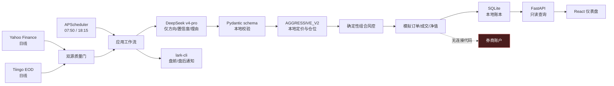

# AI 模拟交易系统架构与安全边界

## 1. 架构目标

系统的首要目标是“可审计的本地模拟”，而不是让语言模型直接下单。对任意候选交易，只有同时满足以下条件才能写入模拟订单：

1. 标的存在于已持久化的自选池。
2. 决策所需行情通过两个独立来源的质量闸门。
3. DeepSeek 返回的 JSON 符合本地强类型 schema，且不包含超出证据集的标的。
4. 本地组合级风控批准整个计划。
5. 订单、交易计划与现金预留能在同一数据库事务中冻结。

任何不确定都采用 fail-closed：生成 `HOLD`、隔离数据、拒绝成交或保留前一个可审计状态，不通过“猜测缺失值”继续执行。

## 2. 系统结构

### 代码边界

| 层 | 目录 | 责任 |
| --- | --- | --- |
| 领域 | `src/ai_trading/domain/` | 强类型证券、订单、交易计划、币种和金额不变式 |
| 交易核心 | `src/ai_trading/trading/` | 风控、成交模型、费用、账本和底层回测引擎 |
| 策略执行 | `src/ai_trading/strategy_v2/` | 60 日特征、ATR 限价、风险预算、整手与仓位计算 |
| 应用 | `src/ai_trading/application/` | 盘前、盘后编排，证据归一化与用例边界 |
| 集成 | `src/ai_trading/integrations/` | DeepSeek、Yahoo、Tiingo 和 `lark-cli` 的外部适配 |
| 持久化 | `src/ai_trading/storage/` | SQLite schema、仓储、订单冻结、模拟结算与净值 |
| 调度 | `src/ai_trading/orchestration/` | 定时任务与飞书消息编排 |
| 查询 | `src/ai_trading/api/` | 只读仪表盘 API，不作交易写入 |
| 展示 | `web/` | React 仪表盘 |

## 3. 盘前数据与决策流

1. 工作流检查账户是否初始化、当日计划是否已冻结、上交所交易日历、时区与 08:45 截止时间。
2. 数据加载器对每个人民币自选标的分别向 Yahoo Finance 和 Tiingo EOD 请求截至证据日的 180 个自然日区间，用于覆盖至少 60 个交易日。
3. 质量门逐日配对两个来源，要求来源独立、标的、交易日和币种相同。历史特征统一使用两源复权 OHLCV；收盘价偏差不超过 100 bps，开盘/最高/最低价偏差不超过 200 bps，成交量对称偏差不超过 40%。合格后成交量取两源较小值用于流动性上限。单日缺少其中一源或超出容差时，该日不会进入合格历史序列；当日模拟成交仍使用原始价格。
4. 每个标的必须具备按上交所日历连续的最后 60 个合格交易会话，且最后一根正好是证据日。系统在本地计算 `SMA20`、`SMA60`、`ATR20`、20 日均量、20 日支撑和阻力；会话缺失、日期错位或出现超过 25% 的疑似未复权除权跳空时，该标的不可用于决策。
5. DeepSeek `deepseek-v4-pro` 只会看到最新合格行情与本地历史特征，并只能返回 `BUY` / `SELL` / `HOLD`、置信度和理由。模型不能指定目标数量、目标权重、限价或止损价。
6. `AGGRESSIVE_V2` 先要求买入满足 `收盘价 > SMA20 ≥ SMA60`，再根据 ATR、1.5% 单笔风险预算、现金、流动性、整手和仓位上限确定限价与目标数量；低于 60% 置信度或无法形成至少一个整手时转为 `HOLD`。已持仓标的触发本地止损时不依赖 DeepSeek，可直接生成减仓意图。
7. 本地再次验证重复标的、超出证据集的标的、过期持仓、动作与数量矛盾等条件。整个计划通过确定性组合风控后，计划、模拟订单和买入现金预留才会在一个事务中冻结。

这 60 根合格历史目前只在盘前进程内用于生成特征，并未作为完整历史序列持久化到回测证据库。DeepSeek 接收的是聚合后的特征，而不是原始 60 根日线。

当前 A 股盘前证据日按 `exchange-calendars` 的上交所日历取前一交易会话。港交所日历、临时休市和逐标的停牌仍未形成生产级统一日历边界；无法证明数据可用时系统保持 `HOLD`。

## 4. `AGGRESSIVE_V2` 本地执行与组合风控

AI 只负责方向、置信度和理由。订单价格、仓位与组合约束均由本地确定性代码计算：

| 执行项 | 本地规则 |
| --- | --- |
| 最低置信度 | 60%；低于阈值转为 `HOLD` |
| 买入趋势确认 | 必须满足 `收盘价 > SMA20 ≥ SMA60`，否则转为 `HOLD` |
| 买入限价 | `min(收盘价 + 0.25 × ATR20, 收盘价 × 1.02)`，按最小价位向下取整 |
| 卖出限价 | `max(收盘价 - 0.25 × ATR20, 收盘价 × 0.98)`，按最小价位向上取整 |
| 买入止损 | 入场距离取 `max(2 × ATR20, 收盘价 × 8%)`，用于仓位计算并随成交买单持久化；后续盘前若收盘价跌破该价，本地规则即使在 AI 缺失时也生成卖出意图。当前没有盘中独立止损订单，因此隔夜跳空仍可能越过止损价 |
| 单笔风险预算 | `账户净值 × 1.5% × AI 置信度` |
| 流动性上限 | 不超过 20 日平均成交量的 5% |
| 现金缓冲 | 买入金额按 0.5% 费用缓冲约束 |
| 标的上限 | 股票不超过净值 30%，ETF / LOF 不超过净值 50% |
| 整手约束 | 所有数量向下取整到整手；不足一手则 `HOLD` |
| 卖出意图 | 只退出当前可卖数量，不超过 `sellable_quantity`；无可卖持仓或不可交易时 `HOLD` |

同一交易日的多个买入信号按置信度从高到低共享剩余现金和“每日新增风险”额度。每个标的完成本地定价与仓位计算后，整个计划还必须通过以下组合级风控闸门：

| 风控项 | 阈值 |
| --- | ---: |
| 单只股票市值上限 | 净值的 30% |
| 单只 ETF / LOF 市值上限 | 净值的 50% |
| 单一市场暴露上限 | 净值的 85% |
| 单一行业暴露上限 | 净值的 60% |
| 每日新增风险上限 | 净值的 50% |
| 每日换手额上限 | 净值的 100% |
| 停止新增风险回撤 | 25% |
| 硬回撤限制 | 30%，仅允许减仓意图 |

计划按“所有买单成交、所有卖单不成交”的保守情形审核，并检查现金、可卖数量、行业归属和标的完整性。任一非 `HOLD` 提案失败时，整个交易计划不会冻结订单。风控批准是写入模拟订单的必要条件，不是对收益或损失的保证。

## 5. 订单与盘后模拟成交

### 数据库不变式

- 每个账户、交易日、标的的组合有唯一约束，实现“同一标的每日最多操作一次”。
- 同一计划内的标的不可重复。
- 买单冻结时使用限价和 0.5% 费用预估预留人民币现金。订单未成交、数据不可用或执行拒绝时释放预留。
- 金额在领域层使用 `Decimal`，在数据库使用百万分之一元的整数 micros，避免二进制浮点金额。

### 旧 SQLite 自动增列迁移

应用启动初始化数据库时，会先执行现有表创建，再检查旧库的 `trade_proposals` 表，并只为缺失字段执行幂等的增列迁移：

- `reason`
- `strategy_version`
- `target_weight_micros`
- `reference_price_micros`
- `stop_price_micros`

旧记录的新增审计字段允许保留为 `NULL`，因此无需重建历史交易数据。该机制只解决 `AGGRESSIVE_V2` 审计字段的 SQLite 向后兼容，不是通用、带版本号的数据库迁移框架；执行前仍建议按运行手册完整备份 SQLite 主文件及 WAL/SHM 文件。

### 模拟成交假设

盘后工作流只使用当日双源通过的 OHLCV，按保守的开盘成交模型做全成或全不成判定：

- 买入开盘价不得高于限价，卖出开盘价不得低于限价。
- 模拟滑点为 0.1%，但成交价不越过限价。
- 非法整手、停牌、零成交量、涨跌停锁定、不可交易标的或数据不匹配一律不成交。
- 不根据日线内容推测盘中成交路径，不伪造部分成交。

当前人民币费率版本 `a-share-simulation-v1` 从 2026-01-01 起生效：佣金 0.03%、最低 5 元，过户费 0.001%，股票买入印花税 0，股票卖出印花税 0.05%。这是当前模拟参数，不是对任何券商实际收费的声明。

成交后记录持仓、现金、费用和日终净值。如果账户全为现金且无待处理订单，即使当日无行情，也可以记录零市值的现金净值。如果已有持仓但缺少任一持仓收盘标记，则不会生成不完整估值。

同日盘后处理在 18:00 前 fail-closed，不修改订单、现金预留或估值；常驻调度仍固定在 18:15 执行。日终结果同时计算账户净值、当日盈亏、累计盈亏与历史高水位回撤，并进入飞书盘后消息。

## 6. 市场覆盖的实际边界

### A 股

- 目前生产初始池只有两只上交所人民币股票：`603005.SH` 和 `600584.SH`。
- 域模型可表达深交所、ETF 和 LOF，风控也有基金上限，但目前没有生产级标的导入、自动发现、交易状态、公司行动或逐板块规则接入。
- 科创板、创业板以及场内基金当前不应被视为已可模拟交易。

### 港股

- `02513.HK` 和 `01810.HK` 已在自选池中，但 `lot_size=None`、`is_tradable=false`。
- 证据加载器目前主动跳过非人民币证券；港币现金、汇率双源、港股费率、整手和交易日历尚未接入。
- 因此当前不会创建港股模拟订单，即使 DeepSeek 可用也不会绕过这些限制。

## 7. 自选标的发现与通知状态

当前实现只在初始化时写入 4 个固定自选标的，没有市场扫描器、候选排名、自动加入用例或对应 CLI/API。代码中定义了 `WATCHLIST_ADDED` 通知类型和通知持久化数据结构，但不等于生产路径已接通。

后续实现自动发现时，必须先核验代码、市场、币种、标的类型、行业、整手、可交易性和数据覆盖，再在同一业务事件中持久化自选变更和飞书通知。这是待开发要求，不是已实现行为。

## 8. 历史回测与影子运行

日常盘前工作流已经会临时获取并校验 60 个交易日的双源历史，用于 `AGGRESSIVE_V2` 特征计算；这不等于历史证据库或回测管道已接通。`src/ai_trading/trading/backtest.py` 已有避免未来数据、使用成交模型和计算绩效的底层能力及单元测试，但应用层 `backtest` 命令没有历史证据加载器，当前固定返回 `NO_DATA` 和 `HISTORICAL_EVIDENCE_UNAVAILABLE`。

同样，当前没有“影子运行日计数”或自动验收闸门。项目尚未累计并审核 20 个交易日的运行记录。在此之前，任何绩效数字都只能解释为有限的本地模拟记录，不能解释为策略已验证。

## 9. 飞书可靠性边界

当前定时任务通过 `lark-cli im +messages-send` 投递盘前计划和盘后报告，且根据通知类型、日期、收件人生成确定性幂等键。

实际调度路径尚未将通知状态写入 SQLite outbox，也没有定时重试派发器。因此：

- 飞书失败不影响模拟交易账本，但需要在日志中单独监控。
- 不应将“工作流已成功”等同于“飞书已送达”。
- 当前的幂等键由 `lark-cli` 消费，跨进程的最终去重语义依赖其实际实现。

## 10. 运行时安全

### 券商隔离

- 健康接口的类型约束固定为 `paper_trading_only=true` 与 `broker_connection=false`。
- 代码中没有真实委托网关、券商 SDK 或证券账户凭据配置。
- “订单”仅为 SQLite 中的业务记录，“成交”仅为日线驱动的模拟结果。

### 网络边界

- Uvicorn 与 Vite 开发服务默认只绑定 `127.0.0.1`。
- API 当前没有身份认证，前提是它仅对本机回环地址可达。不得在未增加认证、TLS 和网络访问控制的情况下改为 `0.0.0.0`。
- 外部请求只发往 DeepSeek、Yahoo/Tiingo 以及由 `lark-cli` 使用的飞书服务。

### 凭据与日志

- 密钥从 `.env` 或进程环境读取，应将 `.env` 权限保持为 `0600`。
- Pydantic `SecretStr` 用于防止凭据被对象表示意外打印；DeepSeek 错误只保留脱敏分类，不保留上游响应正文。
- 不应在命令行、文档、测试固定数据或飞书消息中写入真实凭据。

## 11. 可审计性与当前缺口

已落地的审计记录包括交易计划、提案、模拟订单、模拟成交、持仓、现金、行情观测和日终估值。盘前计划与日终估值按日期幂等。

仍需补齐的可靠性项目包括：

1. 港股交易日历、临时休市、逐标的交易状态和完整公司行动复权数据。A 股已接入上交所会话日历，并对疑似未复权跳空 fail-closed。
2. 历史证据库和应用层回测管道。
3. 至少 20 个交易日的影子运行与自动验收指标。
4. 港股、场内基金、科创板和创业板的数据、费率与交易规则。
5. 自动发现标的、变更审计与“新增后飞书通知”的原子工作流。
6. 飞书持久化 outbox、失败重试和送达状态。
7. 通用、可版本化的数据库 schema 迁移流程。当前只有 `trade_proposals` 的 `AGGRESSIVE_V2` 审计字段支持启动时自动增列，没有可执行的完整版本化迁移文件。
8. 工作流级持久化运行记录。数据库已有 `workflow_runs` 表，但当前调度路径未写入该表，运行故障主要依赖文件日志追踪。

在上述缺口完成之前，系统应保持“本机、模拟、只读展示、缺数据即停止”的运行边界。
